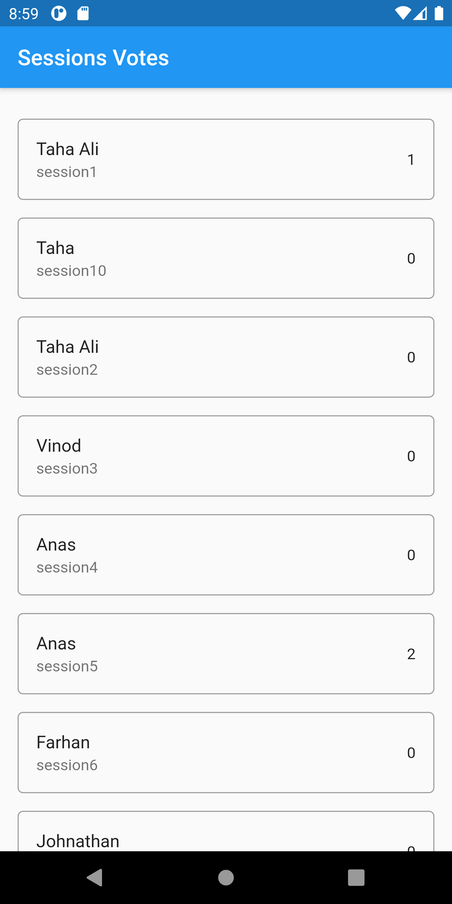
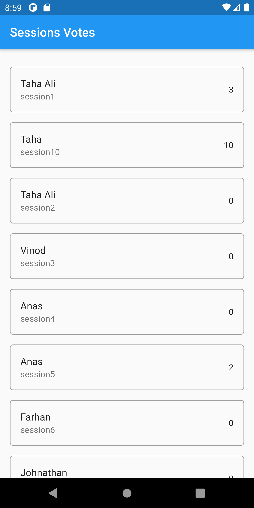
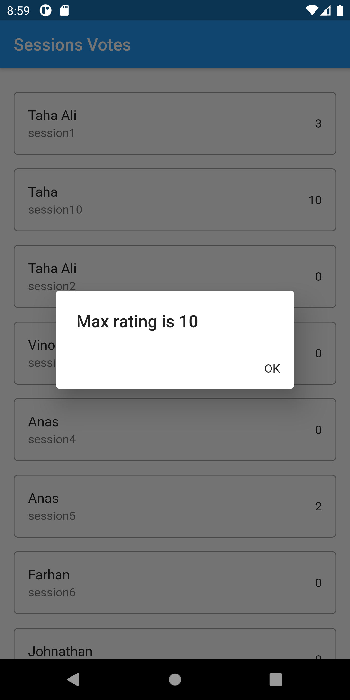

# VD_flutter_training_8

## Firestore

This app communicates with Firestore for data fetching and demonstrates real time data update

# Screenshots

## Sessions with details and option to vote

## Observe that second reached 10 votes on clicking

## Restriction on voting limit
